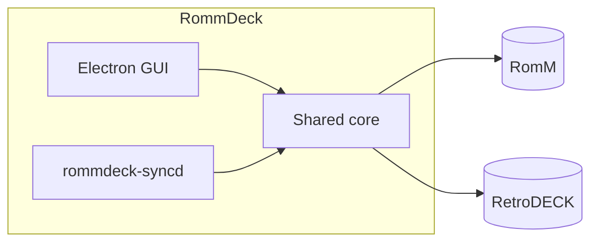

# RommDeck

**Browse your RomM library, download into RetroDECK, and sync saves in the background.**

RommDeck is a Linux desktop app that connects **[RomM](https://github.com/rommapp/romm)** (your self-hosted library) with **[RetroDECK](https://retrodeck.net/)** (your local emulation environment). Download ROMs to the right folders, populate ES-DE with metadata and artwork from RomM, and keep battery saves and save states synced across devices—even when the app is closed.

Built with Electron, React, and TypeScript. RomM 5.x and RetroDECK on Linux.

---

## Features

### Library and downloads

- **Browse by platform** — paginated ROM lists with cover art from RomM
- **Search** — find games across your library
- **Single, bulk, and platform downloads** — queue one game, a selection, or everything on a platform
- **Download queue** — active and failed sections, progress, cancel, retry, dismiss; persists across restarts
- **Downloaded badges** — live updates in the library and status bar when jobs complete
- **Local delete** — remove ROM files, index entries, and matching ES-DE gamelist/media

### ES-DE integration

- **Automatic metadata** — on each download, write `gamelist.xml` from RomM (title, description, genre, release date, developer, publisher, …)
- **Artwork** — covers, screenshots, and videos into ES-DE’s `downloaded_media` tree when RomM has them
- **No re-scraping** — games show up in RetroDECK ready to play

### Save and state sync

- **RomM Device Sync Protocol** — negotiate, upload/download, complete session ([docs](https://docs.romm.app/5.1.0/developers/device-sync-protocol/))
- **Sync Now** — manual sync from the GUI
- **Background daemon** — `rommdeck-syncd` as a systemd user service: interval poll, startup sync, filesystem watch on save folders
- **One-click enable** — Settings installs and starts the daemon; no manual unit setup in normal use
- **Battery saves and save states** — RetroArch paths on RetroDECK-default platforms (`.srm`, `.state`, `.state0`–`.state9`, …)
- **Conflict policies** — `keep_both`, `server_wins`, or `device_wins`; same policy for manual and auto sync
- **Multi-device** — register as a RomM sync device; slot-based sync across machines

### Settings and polish

- **RetroDECK auto-detection** — reads Flatpak `retrodeck.json` for ROM, save, and state paths
- **Platform map editor** — override RomM slug → ES-DE folder mappings when your library layout differs
- **Themes** — candy, gold, vector, mint with optional CRT scanline overlay
- **Structured logging** — configurable debug/info/warn/error; open the log file from Settings
- **Arcade-style shell** — sidebar navigation, accent frame, custom window controls

---

## How it works



| Piece | What it does |
| --- | --- |
| **GUI** | Library, downloads, sync controls, settings |
| **Core** | RomM client, download manager, SQLite index, ES-DE writer, sync engine |
| **Daemon** | Runs sync on a timer and when save files change |

Config and state live in standard XDG paths (`~/.config/rommdeck/`, `~/.local/share/rommdeck/`). GUI and daemon share one config file and one library database.

---

## Requirements

- Linux with **RetroDECK** (Flatpak)
- **Node.js 20+** (for building from source)
- **RomM 5.x** reachable from your machine
- RomM **Client API Token** with library, asset, and device scopes ([details](#romm-api-token))

---

## Quick start

```bash
git clone https://github.com/shenoyranjith/rommdeck.git
cd rommdeck
npm install
npm run build:core
npm run dev:gui
```

1. Open **Settings → RomM** — set your RomM URL and API token, test connection.
2. Confirm **Settings → Retrodeck** paths (auto-detected from RetroDECK).
3. Browse the **Library**, download a game, check it appears in RetroDECK.
4. Optional: **Settings → Auto-sync → Enable** for background save sync.

### RomM on another host

```bash
ssh -L 8080:localhost:8080 user@romm-host
# use http://127.0.0.1:8080 as romm.baseUrl
```

### Native module note

The GUI and sync daemon use separate `better-sqlite3` builds (Electron vs system Node). If the GUI reports `NODE_MODULE_VERSION` after running tests:

```bash
npm run rebuild:electron
```

---

## RomM API token

Create in RomM → **Administration → Client API Tokens**.

| Feature | Scopes |
| --- | --- |
| Browse and download ROMs | platforms + roms read |
| Save and state sync | `assets.read`, `assets.write` |
| Device registration | `devices.read`, `devices.write` |

---

## Save sync in brief

RommDeck discovers saves under RetroDECK’s default RetroArch layout:

```text
{saves_path}/{platform}/{game_basename}.srm
{states_path}/{platform}/{game_basename}.state
```

Sync runs when you click **Sync Now**, on a schedule (default 5 min), and after save files change (debounced, default 45 s). RomM matches saves by **slot** (`default`, `state`, `state0`, …), not by timestamped server filenames.

**v1 scope:** RetroArch-default platforms only. Standalone emulators (Dolphin, PCSX2, …) and custom save-path layouts are not supported yet.

---

## Configuration

`~/.config/rommdeck/config.json` — shared by GUI and daemon. See `fixtures/config.example.json`.

| Setting | Default | Notes |
| --- | --- | --- |
| `sync.enabled` | `false` | Toggle via Settings → Auto-sync |
| `sync.intervalSeconds` | `300` | Background poll interval |
| `sync.debounceSeconds` | `45` | Delay after save write before sync |
| `sync.conflictPolicy` | `keep_both` | Or `server_wins`, `device_wins` |
| `logging.level` | `info` | `debug`, `info`, `warn`, `error` |

Override config/data dirs: `ROMMDECK_CONFIG_DIR`, `ROMMDECK_DATA_DIR`.

---

## Development

```
packages/core/     RomM client, downloads, sync, SQLite, ES-DE
packages/gui/      Electron + React UI
packages/syncd/    Background sync CLI
packaging/systemd/ systemd unit template
data/              Platform and emulator slug maps
```

| Command | Purpose |
| --- | --- |
| `npm run dev:gui` | Development GUI |
| `npm run dev:syncd` | Run daemon without systemd |
| `npm run build` | Production build (core + syncd + GUI) |
| `npm run install:syncd` | Install daemon + systemd unit |
| `npm run test:core` | Unit tests |
| `npm run typecheck` | Typecheck all packages |

Roadmap and design notes: [`RommDeck-plan.md`](RommDeck-plan.md).

---

## Limitations

RommDeck does not upload ROMs to RomM, launch games, pick RetroArch cores, or sync standalone-emulator saves in v1. Bulk unattended ROM downloads and Flatpak packaging are out of scope for now.

---

## Acknowledgments

- **[Tender (romm-tender)](https://github.com/danielcopper/romm-tender)** by [danielcopper](https://github.com/danielcopper) — reference for understanding RomM’s Device Sync Protocol and save/state sync behavior. RommDeck targets RetroDECK on Linux desktop; it is not affiliated with Tender and does not share its codebase.

---

## License

[MIT](LICENSE) © 2026 [shenoyranjith](https://github.com/shenoyranjith)
