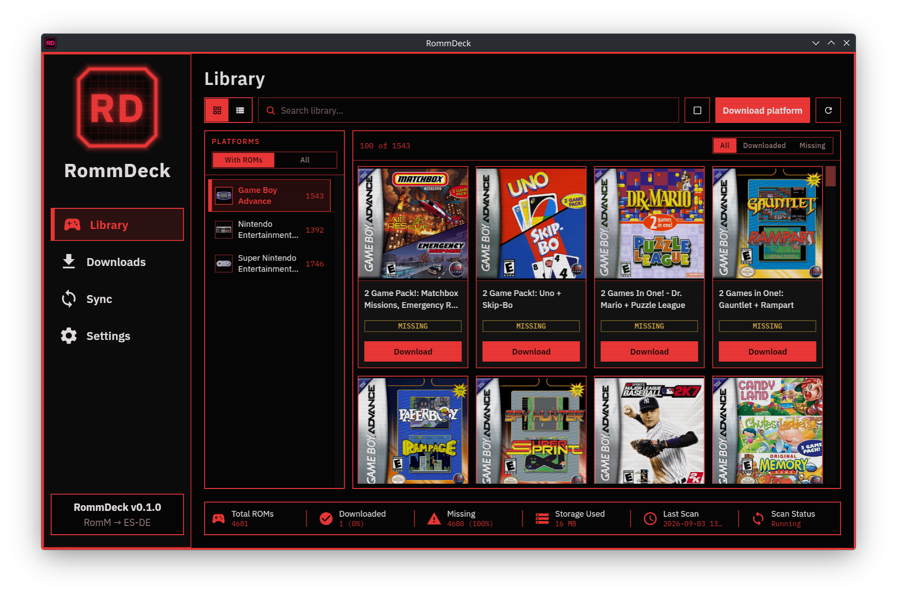
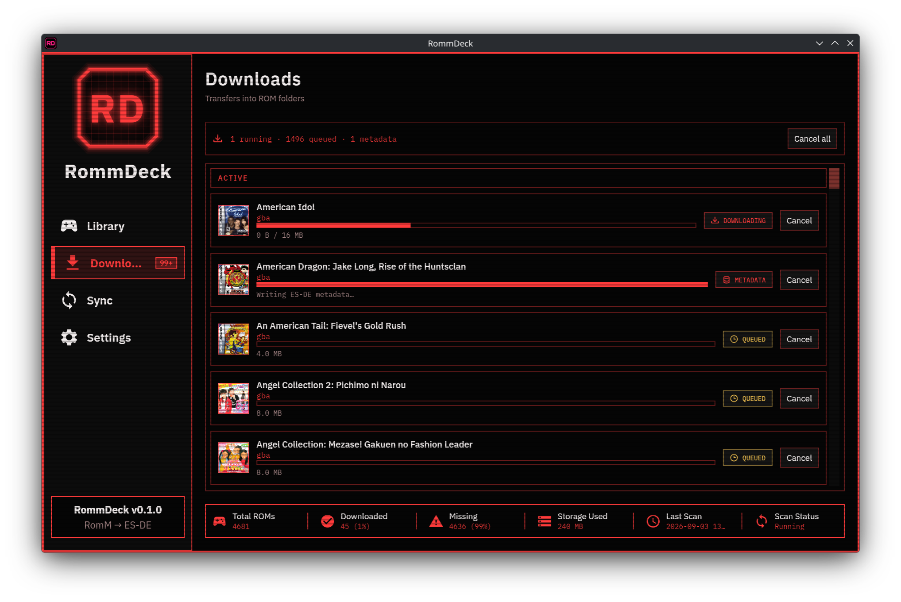
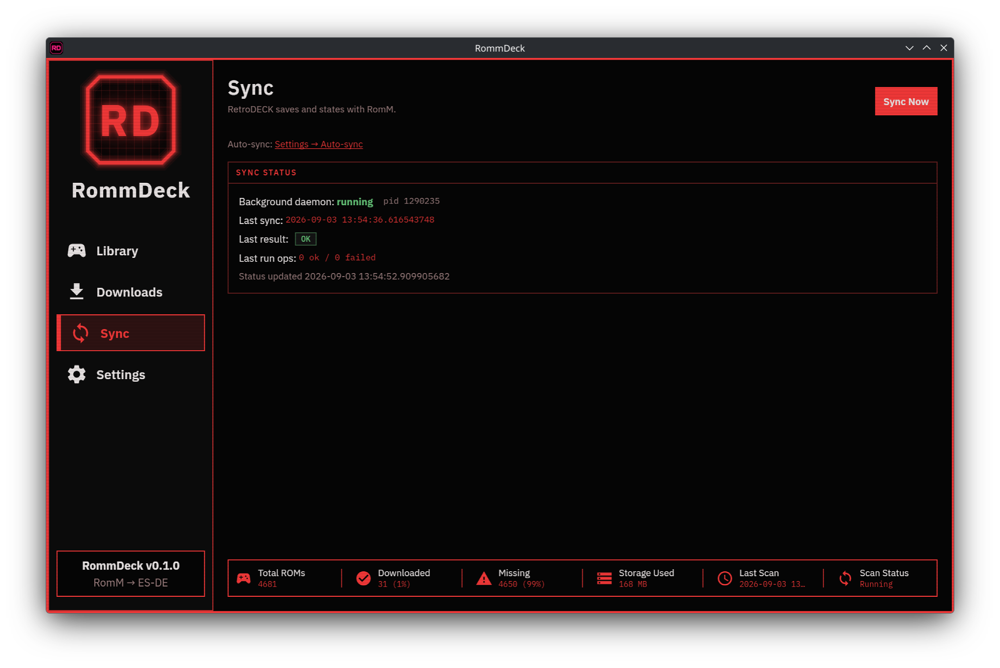
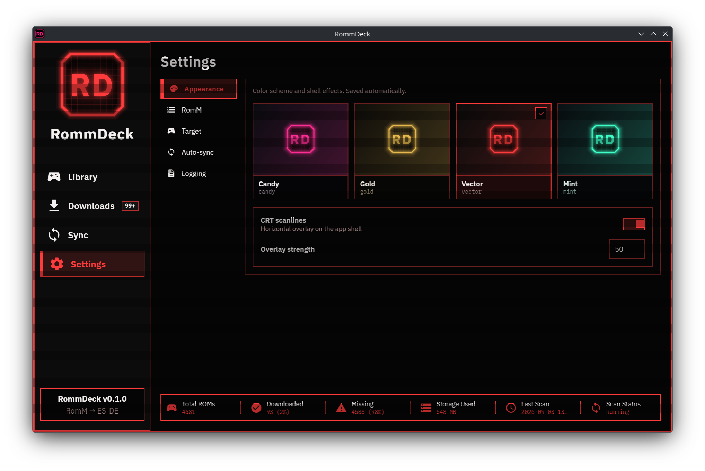
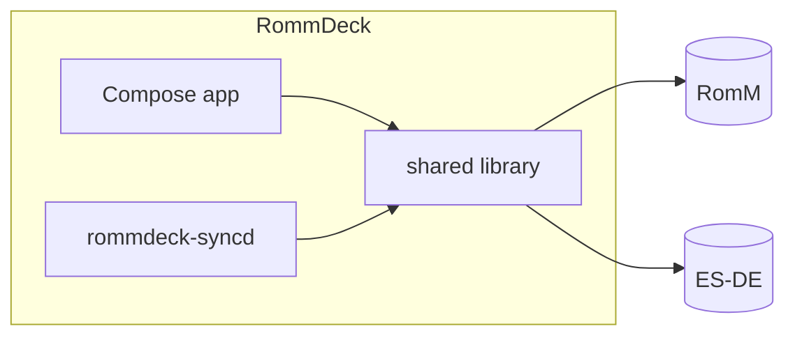

# RommDeck

**Browse your RomM library, download into your ES-DE library folders, and sync saves in the background.**

RommDeck connects **[RomM](https://github.com/rommapp/romm)** (your self-hosted library) to an **[ES-DE](https://www.es-de.org/)** frontend on your machine. It downloads ROMs into the right folders, writes gamelist metadata and artwork from RomM, and keeps battery saves and save states synced across devices—even when the app is closed.

**How we think about the stack**

| Layer | What RommDeck treats it as |
| --- | --- |
| **[RetroDECK](https://retrodeck.net/)** | Supported **platform** (Linux desktop) — known folder layout; auto-detected via `retrodeck.json` when Target paths are empty |
| **ES-DE** | Supported **frontend** — gamelist.xml + `downloaded_media` (ES-DE does not install emulators itself) |
| **Manual Target** (desktop) | Plain ES-DE, EmuDeck, custom — set **ES-DE home** + ROM / save / state when not using RetroDECK auto-detect |

RommDeck does not install emulators or configure RetroArch cores. Tools like EmuDeck set those up; RommDeck only needs the library folders.

**Android:** use **[Argosy](https://github.com/rommapp/argosy-launcher)** — the RomM project’s native Android client for syncing, installing, and launching on phones/handhelds. RommDeck is the **desktop** RetroDECK / ES-DE companion and does not ship an Android app.

Built with **Kotlin Multiplatform** and **Compose**. Targets **RomM 5.x**. **v0.1.0** ships a **Linux** app (AppImage or run from source); macOS and Windows desktop are later.
> **Disclaimer:** RommDeck is a spare-time project built with help from AI coding tools. Expect rough edges; treat it as experimental and back up saves before enabling sync.

---

## Screenshots

| Library | Downloads |
| --- | --- |
|  |  |

| Sync | Settings |
| --- | --- |
|  |  |

---

## Install (Linux AppImage)

RommDeck ships as a **portable AppImage** — one file you download and run. It does **not** install into `/usr` or register with a package manager.

1. Download the latest `RommDeck-*-linux-*.AppImage` from [GitHub Releases](https://github.com/shenoyranjith/rommdeck/releases) (or the Actions artifact while testing).
2. Make it executable and start it:

```bash
chmod +x RommDeck-*-linux-*.AppImage
./RommDeck-*-linux-*.AppImage
```

3. Optional: move it somewhere permanent (e.g. `~/Applications/`) and add a desktop shortcut yourself.
4. In the app: **Settings → RomM**, **Settings → Target**, then use the Library. Optional: **Settings → Auto-sync → Enable**.

| Distro notes | |
| --- | --- |
| **CachyOS / Arch / Fedora / most desktops** | Run the AppImage from a normal user session. |
| **SteamOS / Steam Deck** | Prefer Desktop Mode. If the AppImage fails to mount (FUSE), try `APPIMAGE_EXTRACT_AND_RUN=1 ./RommDeck-*.AppImage`. |
| **No system Java needed** | The AppImage bundles a JRE for the GUI. Enabling auto-sync copies a sidecar + runtime under `~/.local/share/rommdeck/syncd/` so the daemon keeps running after you quit. |

**Updates:** replace the AppImage file with a newer one and open it once. If auto-sync was enabled, the app refreshes the installed daemon when its version stamp differs.

Config and library data live in `~/.config/rommdeck/` and `~/.local/share/rommdeck/` (shared across AppImage and source builds).

---

## Features

### Library and downloads

- **Browse by platform** — paginated ROM lists with cover art from RomM
- **Grid and list views** — preference saved across restarts
- **Search** — find games across your library
- **Single, bulk, and platform downloads** — queue one game, a selection, or everything on a platform
- **Download queue** — active and failed sections, progress, cancel, retry, dismiss; persists across restarts
- **Downloaded badges** — live updates in the library and sidebar when jobs complete
- **Local delete** — remove ROM files, index entries, and matching ES-DE gamelist/media

### Frontend integration (ES-DE)

- **Automatic metadata** — on each download, write `gamelist.xml` from RomM (title, description, genre, release date, developer, publisher, …)
- **Artwork** — covers, screenshots, and videos into ES-DE’s `downloaded_media` tree when RomM has them
- **No re-scraping** — games show up in the frontend ready to play
- **Platform map** — map RomM platform slugs to your library folder names

### Save and state sync

- **RomM Device Sync Protocol** — negotiate, upload/download, complete session ([docs](https://docs.romm.app/5.1.0/developers/device-sync-protocol/))
- **Sync Now** — manual sync from the app
- **Background daemon** — `rommdeck-syncd` (Linux: systemd user service) — interval poll, startup sync, filesystem watch on save folders
- **One-click enable** — Settings installs and starts the daemon on Linux; no manual unit setup in normal use
- **Battery saves and save states** — RetroArch layout under your configured save/state roots (`.srm`, `.state`, `.state0`–`.state9`, …)
- **Two-way, download-only, and upload-only** — directional sync enforced locally; RomM device registration uses supported API modes
- **Conflict policies** — `keep_both`, `server_wins`, or `device_wins`; same policy for manual and auto sync
- **Multi-device** — register as a RomM sync device; slot-based sync across machines

### Settings and polish

- **Target paths** — RetroDECK auto-detect on Linux when empty; for plain ES-DE set **ES-DE home** (e.g. `~/ES-DE`) plus ROM / save / state folders (ROMs are often outside the ES-DE tree); EmuDeck / custom use the same manual fields
- **Platform map editor** — override RomM slug → library folder mappings when your layout differs
- **Themes** — candy, gold, vector, mint with optional CRT scanline overlay
- **Structured logging** — configurable debug/info/warn/error
- **Arcade-style shell** — sidebar navigation, accent frame, custom window controls

---

## How it works



| Piece | What it does |
| --- | --- |
| **App** | Library, downloads, sync controls, settings |
| **Shared library** | RomM client, download manager, SQLite index, ES-DE writer, sync engine |
| **Daemon** | Background save/state sync (Linux today) |

Config and state use standard paths on each platform (Linux: `~/.config/rommdeck/`, `~/.local/share/rommdeck/`). The app and daemon share one config file and one library database.

---

## Requirements

### Runtime (AppImage or from source)

- **Linux** desktop (SteamOS Desktop Mode, CachyOS, Fedora, …; macOS and Windows planned)
- **Library folders** — RetroDECK (auto-detect) or Settings → Target: **ES-DE home** + ROM / save / state (EmuDeck, official ES-DE, custom)
- **RomM 5.x** reachable from your machine
- RomM **Client API Token** with library, asset, and device scopes ([details](#romm-api-token))

### Building from source / packaging

- **JDK 17–25** with a **full (non-headless)** AWT install for the GUI — on Fedora: `sudo dnf install java-25-openjdk`
- **AppImage packaging** also needs `jlink` + `jpackage` (JDK devel + jmods) — on Fedora: `sudo dnf install java-25-openjdk-devel java-25-openjdk-jmods`

---

## Quick start (from source)

```bash
git clone https://github.com/shenoyranjith/rommdeck.git
cd rommdeck/src
./run-desktop.sh
```

For UI work with Compose Hot Reload (save Kotlin files → UI updates without a full restart):

```bash
./run-desktop-hot.sh
```

1. Open **Settings → RomM** — set your RomM URL and API token, test connection.
2. Open **Settings → Target** — RetroDECK: leave empty to auto-detect. Plain ES-DE: set **ES-DE home** (e.g. `/home/you/ES-DE`) and **ROMs folder** (e.g. `/home/you/ROMs`), plus saves/states if needed.
3. Browse the **Library**, download a game, check it appears in ES-DE.
4. Optional: **Settings → Auto-sync → Enable** for background save sync (Linux; installs and starts `rommdeck-syncd`).

### RomM on another host

```bash
ssh -L 8080:localhost:8080 user@romm-host
# use http://127.0.0.1:8080 as romm.baseUrl
```

### Headless JDK / no display

Compose Desktop needs a real display and `libawt_xawt.so`. From the repo’s `src/` directory:

```bash
./check-display.sh
export DISPLAY=:0   # if needed in an IDE terminal
./run-desktop.sh
```

See [`src/README.md`](src/README.md) for troubleshooting display issues and development workflows.

---

## RomM API token

Create in RomM → **Administration → Client API Tokens**.

| Feature | Scopes |
| --- | --- |
| Browse and download ROMs | platforms + roms read |
| Save and state sync | `assets.read`, `assets.write` |
| Device registration | `devices.read`, `devices.write` |

---

## Save sync in brief

RommDeck discovers saves under your configured **save** and **state** Target roots, using the default **RetroArch** layout:

```text
{saves_path}/{platform}/{game_basename}.srm
{states_path}/{platform}/{game_basename}.state
```

On **desktop / RetroDECK**, those roots often sit under the ES-DE/RetroDECK tree. Point Settings → Target at the folders your machine actually uses.

Sync runs when you click **Sync Now**, on a schedule (default 5 min), and after save files change (debounced, default 45 s). RomM matches saves by **slot** (`default`, `state`, `state0`, …), not by timestamped server filenames.

### Platform / emulator save status

What RommDeck can sync today vs planned (inspired by tables like [Freegosy](https://github.com/abduznik/Freegosy#platform--emulator-status)). Status is about **save/state sync**, not launching games.

| Emulator | Status | Notes |
| --- | --- | --- |
| **RetroArch** | Supported | Default `{platform}/{game}.srm` / `.state*` under Target save/state paths. Covers the RetroArch-mapped platforms in [`data/platform-emulator-map.json`](data/platform-emulator-map.json). |
| **Dolphin** | Planned | GC/Wii standalone paths via platform-emulator map. |
| **PCSX2** | Planned | PS2 memcards / per-game folders. |
| **PPSSPP** | Planned | PSP save data directory. |
| **DuckStation** | Planned | PS1 memory cards. |
| **Other standalone** | Not yet | Ryujinx, RPCS3, etc. — track per-emulator path rules as we expand sync. |

**v1 scope:** RetroArch layouts only. Standalone emulators need explicit path rules before sync can find their saves.

For **Android** save sync and launching, use **[Argosy](https://github.com/rommapp/argosy-launcher)** instead of RommDeck.

---

## Configuration

`~/.config/rommdeck/config.json` — shared by the app and daemon. See `fixtures/config.example.json`. Settings → Target is stored under `"target"`.

| Setting | Default | Notes |
| --- | --- | --- |
| `target.*Path` | auto or manual | ROM / save / state folders (Settings → Target); RetroDECK auto or manual for any layout |
| `target.esdeHomePath` | auto or manual | ES-DE frontend home (`gamelists/`, media); required when ROMs are outside that tree |
| `sync.enabled` | `false` | Toggle via Settings → Auto-sync |
| `sync.mode` | `push_pull` | Or `pull_only` (download only), `push_only` (upload only) |
| `sync.intervalSeconds` | `300` | Background poll interval |
| `sync.debounceSeconds` | `45` | Delay after save write before sync |
| `sync.conflictPolicy` | `keep_both` | Or `server_wins`, `device_wins` |
| `ui.libraryViewMode` | `grid` | Or `list` |
| `ui.theme` | `candy` | candy, gold, vector, mint |
| `logging.level` | `info` | `debug`, `info`, `warn`, `error` |

Override config/data dirs: `ROMMDECK_CONFIG_DIR`, `ROMMDECK_DATA_DIR`.

RomM or auto-sync settings changes restart a running `rommdeck-syncd` so path and interval updates take effect.

---

## Development

All application code lives under [`src/`](src/). Developer guide: [`src/README.md`](src/README.md).

```
src/
  shared/          KMP library — RomM, downloads, sync, SQLite, ES-DE
  apps/desktop/    Compose Desktop app (Linux today; KMP-ready for more OSes)
  apps/syncd/      Background sync daemon (JVM)
data/              Platform and emulator slug maps
packaging/systemd/ systemd user unit template (Linux)
```

| Command | Purpose |
| --- | --- |
| `./run-desktop.sh` | Run the desktop app |
| `./run-desktop-hot.sh` | Run with Compose Hot Reload |
| `./gradlew :apps:syncd:installDist` | Build sync daemon install tree |
| `./gradlew :shared:jvmTest` | Unit tests |
| `./gradlew build` | Build desktop, syncd, and shared |
| `bash ../scripts/seed-dev-tree.sh` | Seed a local ES-DE folder tree + sample config (from `src/`) |
| `../scripts/package-linux-appimage.sh` | Build a Linux `.AppImage` (run from repo root) |

After changing sync daemon code, rebuild and redeploy the installed sidecar (or toggle auto-sync off/on in Settings):

```bash
./gradlew :apps:syncd:installDist
rsync -a --delete apps/syncd/build/install/rommdeck-syncd/ ~/.local/share/rommdeck/syncd/
systemctl --user restart rommdeck-syncd.service
```

### Linux AppImage (build locally)

```bash
# from repo root — needs jlink/jpackage (see Requirements)
./scripts/package-linux-appimage.sh
# → dist/RommDeck-<version>-linux-x86_64.AppImage
```

**CI:** [`.github/workflows/package-linux-appimage.yml`](.github/workflows/package-linux-appimage.yml) builds on:

- pushes to `main` (artifact upload)
- version tags `v*` (creates/updates the GitHub Release and attaches the AppImage)
- manual **workflow_dispatch**
- pull requests that touch packaging paths (artifact upload)

To publish a release:

```bash
git tag -a v0.1.0 -m "v0.1.0"
git push origin v0.1.0
```

Re-running for an existing tag (after a workflow fix on `main`):

```bash
git push origin :refs/tags/v0.1.0   # delete remote tag
git push origin v0.1.0              # push again → builds + attaches AppImage
```

End users: prefer [Install (Linux AppImage)](#install-linux-appimage). Developer packaging details: [`src/README.md`](src/README.md).

Roadmap and design notes: [`RommDeck-plan.md`](RommDeck-plan.md).

---

## Limitations

RommDeck does not upload ROMs to RomM, launch games, or pick RetroArch cores. **v0.1.0** is Linux-first with **RetroDECK** as the auto-detected platform and **ES-DE** as the frontend contract; other layouts use Settings → Target (**ES-DE home** when ROMs sit outside the frontend tree). See [Platform / emulator save status](#platform--emulator-save-status). **Android is out of scope** — use [Argosy](https://github.com/rommapp/argosy-launcher). A **Linux AppImage** is built via GitHub Actions; standalone-emulator save paths and macOS/Windows installers are later work.

---

## Acknowledgments

- **[Argosy](https://github.com/rommapp/argosy-launcher)** — official RomM Android client. Prefer Argosy on phones/handhelds; RommDeck focuses on desktop RetroDECK / ES-DE.
- **[Tender (romm-tender)](https://github.com/danielcopper/romm-tender)** by [danielcopper](https://github.com/danielcopper) — reference for understanding RomM’s Device Sync Protocol and save/state sync behavior. RommDeck is an independent RetroDECK / ES-DE companion and is not affiliated with Tender.

---

## License

[MIT](LICENSE) © 2026 [shenoyranjith](https://github.com/shenoyranjith)
