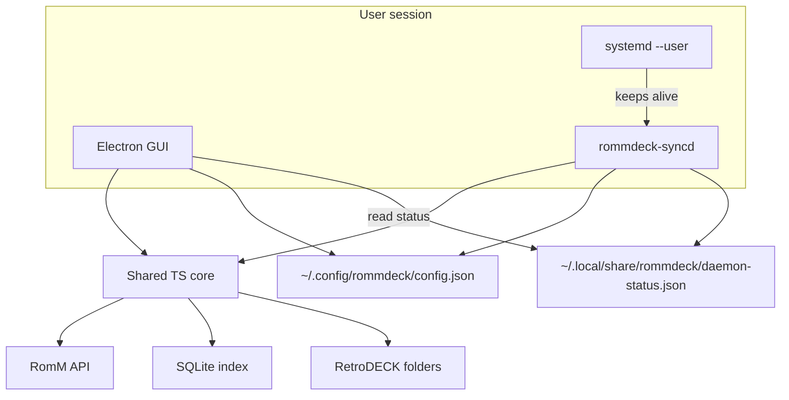

# RommDeck: RomM ↔ RetroDECK Desktop Bridge

## Goal

A Linux desktop stack that treats **RomM as the library source of truth** and **RetroDECK as the local play target**:

- **GUI**: browse by platform, download ROMs (one or whole platform), see/delete local copies, configure sync
- **Background service**: keep saves/states auto-synced with RomM even when the GUI is closed

Greenfield project (no existing repo). Working name: **RommDeck**.

## Stack (chosen default)

- **Shared Node/TypeScript core** — RomM client, RetroDECK paths, downloads, SQLite index, Device Sync Protocol
- **Electron + React + TypeScript GUI** — browse/download/settings; talks to core + reads daemon status
- **`rommdeck-syncd` Node daemon** — long-running process installed as a **systemd user service**
- **better-sqlite3** local index at `~/.local/share/rommdeck/library.db`
- Config at `~/.config/rommdeck/config.json` (shared by GUI and daemon)

Everything stays in TypeScript/Node so you can review it. No Rust.

## Dev environment (Linux + RetroDECK)

Develop and run everything on the Linux host that has RetroDECK installed. RomM is a separate instance reachable on the network (or localhost).

| Concern | Where |
| --- | --- |
| Edit / build / run GUI | Same Linux host |
| Real `retrodeck.json` + Flatpak paths | Auto-detected |
| Downloads into ROM folders | Real RetroDECK `roms_path` |
| `systemd --user` daemon | Same host — validate end-to-end locally |

**Default workflow:**

1. Clone repo, `npm install`, build core, run Electron GUI.
2. Point `romm.baseUrl` at your RomM instance and paste a Client API Token.
3. Auto-detect RetroDECK from `~/.var/app/net.retrodeck.retrodeck/config/retrodeck/retrodeck.json` (override in Settings if needed).
4. Install/enable the `systemd --user` unit for auto-sync on the same machine.

Config lives in one place: `~/.config/rommdeck/config.json` (shared by GUI and daemon). Sync interval / debounce are set there or in Settings.

**Network** — RomM must be reachable from this host. Token scopes include roms/platforms read, assets read/write, devices read/write. If RomM is bound to localhost only on another machine, use an SSH tunnel (`ssh -L 8080:localhost:8080 romm-host`) or open LAN access.

Optional helpers still in the repo: `fixtures/retrodeck.json`, `scripts/seed-dev-tree.sh` (offline/fixture paths if you ever need them), `scripts/deploy-syncd.sh` (rsync install of the daemon binary/unit).

## Architecture



**Split of responsibilities**

| Component | Does | Does not |
| --- | --- | --- |
| Electron GUI | Browse, download ROMs, delete local ROMs, settings, manual Sync Now, show daemon status/history | Stay running for sync |
| `rommdeck-syncd` | Auto save/state sync on an interval + filesystem watch; write status/logs | Download whole ROM libraries unattended (v1) |
| Shared core | All RomM/RetroDECK/sync logic used by both | Own process lifecycle |

## Auto-sync daemon

RomM’s Device Sync Protocol is **poll-based** (no server push). The daemon therefore:

1. Runs under **`systemd --user`** (`rommdeck-syncd.service`) so it starts at login and restarts on failure — no root/`system` unit required for normal Steam Deck / desktop use.
2. On a configurable **interval** (default e.g. 5 minutes; respect RomM’s “don’t poll negotiate tightly” guidance), runs a full negotiate → execute → complete session.
3. Additionally **watches** `saves_path` and `states_path` (Node `fs.watch` / `chokidar`) and **debounces** (e.g. 30–60s after last write) to sync soon after a game saves — without hammering the API.
4. Uses the same device registration + conflict **policy** from config (unattended default: `keep_both` or user-chosen `server_wins` / `device_wins`; GUI can still offer interactive resolution on manual sync).
5. Writes **`daemon-status.json`**: running, last sync time, last result, pending conflicts, last error — GUI reads this (and can `systemctl --user` start/stop/enable via Settings, or shell out to helper scripts).
6. Logs to journald (`StandardOutput=journal`) and optionally `~/.local/share/rommdeck/logs/`.

Ship a unit file such as:

`~/.config/systemd/user/rommdeck-syncd.service`  
(ExecStart = path to packaged `rommdeck-syncd`; `WantedBy=default.target`)

GUI Settings: **Enable auto-sync** toggles `systemctl --user enable --now` / `disable --now`.

## RetroDECK integration

Auto-detect from current RetroDECK config (JSON, not `.cfg`):

`~/.var/app/net.retrodeck.retrodeck/config/retrodeck/retrodeck.json`

Read `paths`:

- `rd_home_path`
- `roms_path`
- `saves_path`
- `states_path`

Allow manual override in Settings if auto-detect fails.

Downloads land in:

`{roms_path}/{esde_folder}/{filename}`

**ES-DE metadata** (so RetroDECK does not re-scrape) is written under `{rd_home_path}/ES-DE/`:

| Asset | Path |
| --- | --- |
| Gamelists | `{rd_home}/ES-DE/gamelists/{esde_folder}/gamelist.xml` |
| Media | `{rd_home}/ES-DE/downloaded_media/{esde_folder}/{type}/` |

On download success, RommDeck upserts `gamelist.xml` from RomM metadata (`name`, `summary`, genres, release date, developer/publisher, etc.) and downloads cover, screenshot, and video assets when available. Media filenames match the game **display name** (ES-DE v1+ convention — no image tags in XML). On local delete, remove the matching gamelist entry and media files.

Read `downloaded_media_path` from `retrodeck.json` when present; default `{rd_home_path}/ES-DE/downloaded_media`.

Platform mapping uses RomM’s ES-DE map (folder → RomM slug), inverted for download targets — e.g. RomM `ngc` → RetroDECK `gc`, `genesis` → `megadrive`. Ship a bundled map (from [config.es-de.example.yml](https://github.com/rommapp/romm/blob/master/examples/config.es-de.example.yml)) plus Settings overrides for custom RomM `system.platforms` configs.

## RomM API usage

Auth: **Client API Token** (`Authorization: Bearer rmm_...`).

| Feature | Endpoints |
| --- | --- |
| Platforms | `GET /api/platforms` |
| Browse/search | `GET /api/roms`, `GET /api/search/roms` |
| Download | `GET /api/roms/{id}/content/{file_name}` (multi-file via `/files` as needed) |
| Device register | `POST /api/devices` |
| Save/state sync | `POST /api/sync/negotiate` → upload/download ops → `POST /api/sync/sessions/{id}/complete` |
| Asset I/O | `POST /api/saves`, `GET /api/saves/{id}/content` (and states equivalents) |

Target against RomM **5.x** OpenAPI (`/openapi.json`).

## UI screens

1. **Setup / Settings** — RomM URL, API token (test connection), RetroDECK path (auto-detect from `retrodeck.json` + browse), platform-map overrides, sync mode (`push_pull` default), **auto-sync on/off**, interval, debounce, unattended conflict policy, daemon install/status.
2. **Library** — **done** — left: platforms; main: ROM grid/list with cover + **Downloaded / Missing** badge; search; multi-select; bulk download/delete; status bar stats.
3. **Downloads** — **done** — Active / Failed sections; per-row progress, cancel, retry, dismiss; toolbar **Cancel all**, **Retry all**, **Clear failed**; persist queue to `download-queue.json`; in-app exit confirm when active jobs remain; write ROMs + ES-DE metadata on success.
4. **Local management** — **done** — filter to downloaded; **Delete from device** removes local file(s) + ES-DE gamelist/media (never deletes on RomM); in-app confirm dialog; detail-pane badges (Downloaded / Unverified / Missing metadata).
5. **Sync** — device pair status; **Sync Now**; daemon status; conflict list when policy leaves items pending. **In progress:** deterministic save discovery + conflict UX polish (see [Save sync](#save--state-sync)).

Visual direction: utility app — clear hierarchy, platform-first navigation, restrained color system (avoid purple-gradient / cream-serif AI clichés), subtle motion on queue progress and status transitions.

## Local inventory logic

- On download success: record `rom_id`, RomM slug, ES-DE folder, filename(s), size, optional SHA1, path; **sync ES-DE metadata** (gamelist + media from RomM).
- On local delete: remove ROM files, SQLite rows, gamelist entry, and associated media under `ES-DE/downloaded_media/`.
- On library load: join RomM list with index; also rescan `{roms_path}/{esde}/*` to catch files added outside the app (match by filename).
- Multi-file ROMs: store all files under the same `rom_id`; “downloaded” = all required files present.

## Save / state sync

Reference: [romm-tender save-file-sync-architecture](https://raw.githubusercontent.com/danielcopper/romm-tender/refs/heads/main/docs/architecture/save-file-sync-architecture.md).

**Status:** Protocol + daemon scaffold **done**. **v1 rollout in progress:** replace fuzzy basename discovery with deterministic RetroArch paths, RomM 4.9+ `content_hash` (MD5), Sync/Settings UX polish, interactive manual conflict resolution.

### What syncs (v1)

| In scope | Out of scope (later) |
| --- | --- |
| RetroArch **battery saves** under `{saves_path}/{esde_folder}/` | Standalone emulators (Dolphin, PCSX2, PPSSPP, …) |
| RetroArch **save states** under `{states_path}/{esde_folder}/` (`.state`, `.state0`–`.state9`) | ES-DE launcher overrides (`alternativeEmulator`) — future release |
| Indexed ROMs only (`library.db` — need `rom_id` + `esde_folder`) | Multi-save / `.m3u` directories, zip-aware `content_hash` |
| **Platform map overrides** in Settings (RomM slug ↔ ES-DE folder) | RetroArch **core** picker in RommDeck (RetroDECK handles cores) |
| Manual **Sync Now** + **auto-sync** daemon (same `@rommdeck/core` engine) | Custom RetroArch save layouts (see below) |

RommDeck assumes **RetroDECK factory RetroArch defaults**: sort saves by content directory **on**, saves in `saves_path` / states in `states_path`, `savefiles_in_content_dir` **off**. Custom save-path settings, sort-by-core layout, flat saves, and folder aliases are **not supported**.

v1 uses bundled [`data/platform-emulator-map.json`](data/platform-emulator-map.json) (`esde_folder → emulator family`, e.g. `retroarch` | `standalone`) to skip standalone-default platforms. Negotiate always uses `emulator: "retroarch"` for synced entries. Future releases extend the same file with standalone families (`dolphin`, `pcsx2`, …) — not a separate RetroArch-only map.

### Discovery (v1 — replacing current heuristic)

**Today:** [`buildNegotiatePayload`](packages/core/src/sync/protocol.ts) walks save trees and fuzzy-matches basenames — wrong for same-title cross-platform games.

**v1 target:** for each indexed ROM on a RetroArch-default platform, construct expected paths and probe disk:

```text
{saves_path}/{esde_folder}/{rom_basename}.{battery_ext}
{states_path}/{esde_folder}/{rom_basename}.state[0-9]
```

- `{esde_folder}` from index (same folder as ROMs)
- `{rom_basename}` = ROM filename without extension, **preserving `(USA)` tags**
- Cross-platform same-name games disambiguated by `{esde_folder}` — no fuzzy matching

New module: [`packages/core/src/sync/save-paths.ts`](packages/core/src/sync/save-paths.ts). Negotiate payload: RomM 4.9+ `ClientSaveState` with `content_hash` (MD5), `slot: "default"`, `updated_at`. Downloads write to canonical local paths (ROM basename + server extension), not server timestamp filenames.

### Manual vs auto-sync

| | **Sync Now** (GUI) | **Auto-sync** (`rommdeck-syncd`) |
| --- | --- | --- |
| Trigger | User button | systemd at login + interval + fs watch (debounced) |
| Process | Electron `sync:now` IPC | Standalone Node CLI — runs when GUI is closed |
| Conflicts | Applies Settings conflict policy | Applies config conflict policy |
| Status | Sync page (daemon status read from file) | Writes `daemon-status.json` |

Settings **Enable auto-sync** → `systemctl --user enable/disable --now rommdeck-syncd.service`. Both paths share `~/.config/rommdeck/config.json` and `library.db`.

### Conflict policy

Default: **`keep_both`** — RomM keeps the server copy and uploads yours as an additional save; local file unchanged. Also supported: `server_wins`, `device_wins`. No `newest_wins` (unreliable timestamps).

### v1 implementation todos

1. **save-discovery** — `save-paths.ts`, refactor `buildNegotiatePayload`, MD5 `content_hash`, `data/platform-emulator-map.json`
2. **manual-sync-ux** — Sync page results, skipped platforms, pending conflicts
3. **settings-sync-ux** — slim Sync page, Auto-sync labels + conflict help text
4. **auto-sync-daemon** — honor `sync.enabled`, restart on config change, watch both roots
5. **conflict-ui** — cancelled; manual sync uses the same conflict policy as the daemon

### Future releases

| Release | Focus |
| --- | --- |
| **2** | Standalone emulator save paths |
| **2** | ES-DE launcher overrides (`alternativeEmulator`) |
| **2+** | Multi-save / `.m3u` directories, zip-container `content_hash` |
| **3+** | Client-side sync kernel, baseline state DB, play-session ingest |

## Save / state sync logic (shared — protocol)

1. Register device with paths pointing at RetroDECK `saves_path` / `states_path`.
2. Build negotiate payload from **indexed downloaded ROMs** on RetroArch-default platforms: deterministic paths per ROM (see above); compute `content_hash` (MD5) + mtime.
3. Execute returned ops (upload multipart, download to canonical `dest_path`, apply conflict choice/policy).
4. Complete session; update status for GUI + journal.

Play-session ingest is out of scope for v1 (empty `play_sessions` on complete).

## Project layout

```
rommdeck/
  packages/core/           # Shared TS: romm client, paths, download, sync, db
  packages/gui/            # Electron + React
  packages/syncd/          # CLI daemon entrypoint
  packaging/systemd/       # rommdeck-syncd.service
  fixtures/retrodeck.json  # Optional sample paths (non-RetroDECK fallback)
  scripts/seed-dev-tree.sh
  scripts/deploy-syncd.sh  # optional rsync install of daemon
  data/platform-map.json          # RomM slug → ES-DE folder (downloads)
  data/platform-emulator-map.json # ES-DE folder → emulator family (sync scope)
  docs/mockups/          # UI direction mockups (Arcade/CRT)
  README.md
```

## Implementation order

1. Monorepo scaffold + shared config + `retrodeck.json` detection
2. Shared RomM client + platform map
3. Download manager + SQLite index + local delete + Library UI
4. Sync core (negotiate/execute/complete) + manual Sync in GUI
5. `rommdeck-syncd` + systemd user unit + watch/interval + status file
6. GUI daemon controls + conflict policy settings
7. README (Linux/RetroDECK workflow, token scopes, systemd)
8. ~~**UI shell + themes**~~ **done** — Vector shell implemented (sidebar, accent frame, status bar, theme picker)
9. ~~**Downloads UI + queue**~~ **done** — see section below
10. **Save sync v1** — deterministic RetroArch discovery, MD5 `content_hash`, Sync/Settings UX, conflict UI (see [Save sync](#save--state-sync))

## UI: Arcade / CRT shell + themes

**Status:** Shell, Library, and Downloads **done**. Theme mockups remain in `docs/mockups/theme-*.png`.

### Decisions

- **Shell / layout source of truth:** implemented App shell (sidebar, accent frame, status bar, Library chrome). Theme mockups remain in `docs/mockups/theme-*.png`.
- **UI stack:** **Tailwind CSS v4** (utilities + CSS-variable themes) + **Radix UI** (unstyled accessible primitives) + **lucide-react** icons. Custom Vector shell — no MUI/Chakra/Ant.
- **Default theme:** `candy` (magenta accents on the vector shell).
- **Selectable themes:** `candy` | `gold` | `vector` | `mint`.
- **Persistence:** `ui.theme` in `~/.config/rommdeck/config.json`; Settings picker; apply via `data-theme` on the document root.
- **Living plan:** This file is the source of truth; update whenever UI direction changes.
- **Mockups:** Live in `docs/mockups/`. Show mockups when discussing UI.

### Shell elements (implemented)

- Left sidebar: RD square brand, wordmark, icon nav with **outline** active state (accent border + accent text), bottom version box
- Outer accent frame around the whole app (square corners)
- Frameless Electron window + mockup-style minimize / maximize / close (accent stroke) top-right
- Main content flush beside sidebar (accent divider); bottom stats/status strip (6-cell grid)
- Library: header + toolbar, platforms rail, ROM grid/list, selection mode, detail pane

### Mockups

| Role | File |
| --- | --- |
| Theme `vector` | `docs/mockups/theme-vector.png` |
| Theme `candy` (default) | `docs/mockups/theme-candy.png` |
| Theme `gold` | `docs/mockups/theme-gold.png` |
| Theme `mint` | `docs/mockups/theme-mint.png` |
| Downloads — active queue | `docs/mockups/downloads-vector-active.png` |
| Downloads — active + failed | `docs/mockups/downloads-vector-failed.png` |
| Downloads — empty | `docs/mockups/downloads-vector-empty.png` |
| Settings — Appearance + RomM | `docs/mockups/settings-vector-candy.png` |
| Settings — Retrodeck + Auto-sync | `docs/mockups/settings-vector-candy-sync.png` |
| Sync — actions + status only | `docs/mockups/sync-vector-slim.png` |

## Settings UI

**Status:** Shell + Appearance, RomM, Retrodeck, Auto-sync **done** (see mockups). Save-sync UX polish (conflict help text, slim Sync page) ships with [Save sync](#save--state-sync) todos.

Mockups: `docs/mockups/settings-vector-*.png`, `docs/mockups/sync-vector-slim.png`.

## Downloads UI + queue

**Status:** **done** (v1). Visual reference: `docs/mockups/downloads-vector-*.png`.

### Layout

- Header: **Downloads** (`text-[1.75rem]`), subtitle “Transfers into RetroDECK ROM folders”
- Summary toolbar: `N downloading · M queued · K failed` + **Cancel all** (when active) + **Clear failed** (when failed)
- Main panel (`border-accent`): **Active** section (progress rows) + **Failed** section (error + Retry/Dismiss) + empty state

### Queue behavior

Job lifecycle: **queued** → **downloading** → **metadata** (ES-DE gamelist + artwork) → **done** | **error** | **cancelled**

| State | Behavior |
| --- | --- |
| Metadata | Visible in ACTIVE section while writing ES-DE metadata from RomM; cancellable |
| Success | Auto-clear from page after metadata completes |
| Failed | Retain until retry or dismiss |
| Cancelled | Discard immediately |
| App exit (active jobs) | In-app confirm: Stay / Quit anyway; queue persisted to `~/.local/share/rommdeck/download-queue.json` |
| App restart | Restore active + failed queue; resume pump |

### Backend additions

- `DownloadManager`: `failedJobs`, `cancelAll`, `retry`, `dismissFailed`, `clearFailed`, persist/restore
- IPC: `downloads:retry`, `downloads:dismissFailed`, `downloads:clearFailed`, `downloads:cancelAll`; updated `downloads:list` shape `{ active, failed }`
- ES-DE: `packages/core/src/esde/gamelist.ts` — gamelist upsert + media download from RomM on success; cleanup on local delete

### GUI file split

```
packages/gui/src/pages/DownloadsPage.tsx
packages/gui/src/pages/downloads/DownloadToolbar.tsx
packages/gui/src/pages/downloads/DownloadList.tsx
packages/gui/src/pages/downloads/DownloadRow.tsx
packages/gui/src/pages/downloads/useDownloadQueue.ts
```

### Implementation todos (Downloads)

All v1 items **done**. Next major work: [Save sync v1](#save--state-sync) (deterministic discovery + UX).

### Library live sync on download

**Status:** **done**

- [`useDownloadInventorySync`](packages/gui/src/hooks/useDownloadInventorySync.ts) in App listens for `downloads:job` with `status === 'done'`, updates catalog cache via [`applyInventoryChange`](packages/gui/src/pages/library/romCache.ts), and [`useLibraryData`](packages/gui/src/pages/library/useLibraryData.ts) subscribes to `onInventoryChange` for live badges/detail.
- [`StatusBar`](packages/gui/src/components/StatusBar.tsx) refreshes library stats immediately on download complete (5s poll remains as fallback).

**Acceptance:** Queue a download from Library → when the job completes, **Downloaded** badge, detail pane, and status bar counts update without reload.

### Later UI passes (not v1 downloads)

Save/state sync conflict UX — same shell + theme system; ships with [Save sync](#save--state-sync) todos.

## v1 non-goals

- Uploading ROMs to RomM
- Deleting ROMs on the RomM server
- Unattended bulk ROM downloading (downloads stay GUI-driven)
- Launching games / controlling RetroDECK/ES-DE
- RetroArch **core** selection in RommDeck (RetroDECK/ES-DE handles this)
- Custom RetroArch save-path layouts (non-RetroDECK defaults)
- Standalone emulator saves (Dolphin, PCSX2, …) — future release
- BIOS/firmware management
- Flatpak packaging (document manual build; packaging can follow)
- Playtime reporting
- System-wide (root) systemd unit

## Risk notes

- **Slug mismatches**: custom RomM folder maps need Settings platform-map overrides (supported).
- **Save path layouts**: v1 syncs RetroArch battery saves + save states on RetroDECK-default platforms only, via deterministic paths from indexed ROMs (`{esde_folder}/{rom_basename}`). Standalone-default platforms skipped until Release 2. Custom RetroArch save settings unsupported.
- **Large multi-disc / folder ROMs**: use RomM file list endpoints and download all parts.
- **Unattended conflicts**: daemon cannot pop UI mid-game; require an explicit default conflict policy in config.
- **Steam Deck Gaming Mode**: user systemd services generally run when the user session is active; document that sync runs in Desktop Mode and while logged in (same as other `--user` services).
