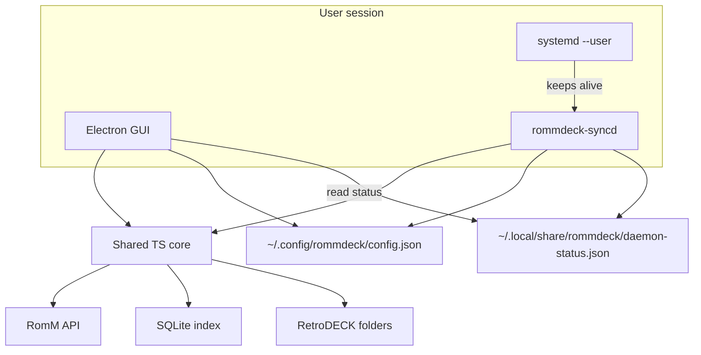

# RommDeck: RomM ↔ RetroDECK Desktop Bridge

## Goal

A Linux desktop stack that treats **RomM as the library source of truth** and **RetroDECK as the local play target**:

- **GUI**: browse by platform, download ROMs (one or whole platform), see/delete local copies, configure sync
- **Background service**: keep saves/states auto-synced with RomM even when the GUI is closed

Greenfield project (no existing repo). Working name: **RommDeck**.

## Stack (chosen default)

- **Shared Node/TypeScript core** — RomM client, RetroDECK paths, downloads, SQLite index, Device Sync Protocol
- **Electron + React + TypeScript GUI** — browse/download/settings; talks to core + reads daemon status
- **`rommdeck-syncd` Node daemon** — long-running process installed as a **systemd user service**
- **better-sqlite3** local index at `~/.local/share/rommdeck/library.db`
- Config at `~/.config/rommdeck/config.json` (shared by GUI and daemon)

Everything stays in TypeScript/Node so you can review it. No Rust.

## Dev environment (Mac + LAN)

Your topology:

| Machine | Role |
| --- | --- |
| MacBook | Edit/build/run most of the app |
| Linux host A | RomM server (LAN URL + API token) |
| Linux host B | RetroDECK (real `retrodeck.json`, roms/saves/states) |

**Default workflow (no SSHFS required):**

1. **Mac day-to-day**
   - Clone repo, `pnpm`/`npm` install, run Electron GUI locally.
   - Config profile `dev` points `romm.baseUrl` at the LAN RomM instance (e.g. `http://192.168.x.x:8080`) and uses a Client API Token from that instance.
   - RetroDECK paths are **not** auto-detected on Mac. Use a local fixture tree that mirrors RetroDECK layout, e.g. `~/rommdeck-dev/retrodeck/{roms,saves,states}/…`, plus a checked-in sample `fixtures/retrodeck.json` (`roms_path` / `saves_path` / `states_path` → that tree). Settings can override paths the same way as production.
   - Download/delete/sync logic is exercised against the fixture dirs + real RomM API. No RetroDECK install needed on the Mac.

2. **Integration on RetroDECK host (Linux B)**
   - SSH from Mac; rsync/deploy script pushes built `packages/syncd` (and optionally GUI) to the box.
   - On that host, auto-detect real `~/.var/app/net.retrodeck.retrodeck/config/retrodeck/retrodeck.json`.
   - Install/enable `systemd --user` unit there — this is the only place auto-sync is validated end-to-end.
   - GUI can also be run on Linux B when you need to test downloads into real ROM folders.

3. **What stays Mac-only vs Linux-only**

| Concern | Mac | RetroDECK Linux |
| --- | --- | --- |
| UI, RomM browse, download into fixture dirs | Yes | Optional |
| Unit tests for core (map, index, negotiate mocks) | Yes | Yes |
| Real `retrodeck.json` + Flatpak paths | No (fixture) | Yes |
| `systemd --user` daemon | No | Yes |

4. **Config profiles** — e.g. `config.dev.json` / env `ROMMDECK_PROFILE=dev|prod`:
   - `dev`: LAN RomM URL, fixture paths, shorter sync interval for testing
   - `prod` (on Linux B): real paths from `retrodeck.json`, normal interval

5. **Network** — Mac and both Linux hosts on same LAN; RomM reachable from Mac and from host B. Token scopes include roms/platforms read, assets read/write, devices read/write. Document firewall if RomM is bound to localhost only on host A (must listen on LAN or use SSH tunnel: `ssh -L 8080:localhost:8080 hostA`).

6. **Optional later** — SSHFS/NFS mount of host B’s `roms_path` on the Mac for “download straight to RetroDECK over the network” while developing; not required for v1.

Dev tooling to ship with the repo: `fixtures/retrodeck.json`, `scripts/seed-dev-tree.sh`, `scripts/deploy-syncd.sh` (rsync + `systemctl --user restart`).

## Architecture



**Split of responsibilities**

| Component | Does | Does not |
| --- | --- | --- |
| Electron GUI | Browse, download ROMs, delete local ROMs, settings, manual Sync Now, show daemon status/history | Stay running for sync |
| `rommdeck-syncd` | Auto save/state sync on an interval + filesystem watch; write status/logs | Download whole ROM libraries unattended (v1) |
| Shared core | All RomM/RetroDECK/sync logic used by both | Own process lifecycle |

## Auto-sync daemon

RomM’s Device Sync Protocol is **poll-based** (no server push). The daemon therefore:

1. Runs under **`systemd --user`** (`rommdeck-syncd.service`) so it starts at login and restarts on failure — no root/`system` unit required for normal Steam Deck / desktop use.
2. On a configurable **interval** (default e.g. 5 minutes; respect RomM’s “don’t poll negotiate tightly” guidance), runs a full negotiate → execute → complete session.
3. Additionally **watches** `saves_path` and `states_path` (Node `fs.watch` / `chokidar`) and **debounces** (e.g. 30–60s after last write) to sync soon after a game saves — without hammering the API.
4. Uses the same device registration + conflict **policy** from config (unattended default: `keep_both` or user-chosen `server_wins` / `device_wins`; GUI can still offer interactive resolution on manual sync).
5. Writes **`daemon-status.json`**: running, last sync time, last result, pending conflicts, last error — GUI reads this (and can `systemctl --user` start/stop/enable via Settings, or shell out to helper scripts).
6. Logs to journald (`StandardOutput=journal`) and optionally `~/.local/share/rommdeck/logs/`.

Ship a unit file such as:

`~/.config/systemd/user/rommdeck-syncd.service`  
(ExecStart = path to packaged `rommdeck-syncd`; `WantedBy=default.target`)

GUI Settings: **Enable auto-sync** toggles `systemctl --user enable --now` / `disable --now`.

## RetroDECK integration

Auto-detect from current RetroDECK config (JSON, not `.cfg`):

`~/.var/app/net.retrodeck.retrodeck/config/retrodeck/retrodeck.json`

Read `paths`:

- `rd_home_path`
- `roms_path`
- `saves_path`
- `states_path`

Allow manual override in Settings if auto-detect fails.

Downloads land in:

`{roms_path}/{esde_folder}/{filename}`

Platform mapping uses RomM’s ES-DE map (folder → RomM slug), inverted for download targets — e.g. RomM `ngc` → RetroDECK `gc`, `genesis` → `megadrive`. Ship a bundled map (from [config.es-de.example.yml](https://github.com/rommapp/romm/blob/master/examples/config.es-de.example.yml)) plus Settings overrides for custom RomM `system.platforms` configs.

## RomM API usage

Auth: **Client API Token** (`Authorization: Bearer rmm_...`).

| Feature | Endpoints |
| --- | --- |
| Platforms | `GET /api/platforms` |
| Browse/search | `GET /api/roms`, `GET /api/search/roms` |
| Download | `GET /api/roms/{id}/content/{file_name}` (multi-file via `/files` as needed) |
| Device register | `POST /api/devices` |
| Save/state sync | `POST /api/sync/negotiate` → upload/download ops → `POST /api/sync/sessions/{id}/complete` |
| Asset I/O | `POST /api/saves`, `GET /api/saves/{id}/content` (and states equivalents) |

Target against RomM **5.x** OpenAPI (`/openapi.json`).

## UI screens

1. **Setup / Settings** — RomM URL, API token (test connection), RetroDECK path (auto-detect from `retrodeck.json` + browse), platform-map overrides, sync mode (`push_pull` default), **auto-sync on/off**, interval, debounce, unattended conflict policy, daemon install/status.
2. **Library** — left: platforms; main: ROM grid/list with cover + **Downloaded / Missing** badge; search; multi-select.
3. **Downloads** — queue with per-item + per-platform bulk; progress, cancel, retry; write into mapped RetroDECK folders; update SQLite index on success.
4. **Local management** — filter to downloaded; **Delete from device** removes local file(s) only (never deletes on RomM); confirm dialog.
5. **Sync** — device pair status; **Sync Now** (via core, same as daemon); live/last daemon status; conflict list for manual resolution when policy left them pending.

Visual direction: utility app — clear hierarchy, platform-first navigation, restrained color system (avoid purple-gradient / cream-serif AI clichés), subtle motion on queue progress and status transitions.

## Local inventory logic

- On download success: record `rom_id`, RomM slug, ES-DE folder, filename(s), size, optional SHA1, path.
- On library load: join RomM list with index; also rescan `{roms_path}/{esde}/*` to catch files added outside the app (match by filename).
- Multi-file ROMs: store all files under the same `rom_id`; “downloaded” = all required files present.

## Save / state sync logic (shared)

1. Register device with paths pointing at RetroDECK `saves_path` / `states_path`.
2. Build negotiate payload from **indexed downloaded ROMs** only: scan save/state files tied by content basename / common emulator layouts; compute mtime + SHA1.
3. Execute returned ops (upload multipart, download to `dest_path`, apply conflict choice/policy).
4. Complete session; update status for GUI + journal.

Play-session ingest is out of scope for v1 (empty `play_sessions` on complete).

## Project layout

```
rommdeck/
  packages/core/           # Shared TS: romm client, paths, download, sync, db
  packages/gui/            # Electron + React
  packages/syncd/          # CLI daemon entrypoint
  packaging/systemd/       # rommdeck-syncd.service
  fixtures/retrodeck.json  # Dev sample paths for Mac
  scripts/seed-dev-tree.sh
  scripts/deploy-syncd.sh  # rsync + restart on RetroDECK host
  data/platform-map.json
  README.md
```

## Implementation order

1. Monorepo scaffold + shared config profiles + `retrodeck.json` detection + Mac fixtures
2. Shared RomM client + platform map (pointed at LAN RomM)
3. Download manager + SQLite index + local delete + Library UI
4. Sync core (negotiate/execute/complete) + manual Sync in GUI
5. `rommdeck-syncd` + systemd user unit + watch/interval + status file
6. GUI daemon controls + conflict policy settings
7. Deploy script + README (Mac/LAN/Linux workflow, token scopes, systemd)

## v1 non-goals

- Uploading ROMs to RomM
- Deleting ROMs on the RomM server
- Unattended bulk ROM downloading (downloads stay GUI-driven)
- Launching games / controlling RetroDECK/ES-DE
- BIOS/firmware management
- Flatpak packaging (document manual build; packaging can follow)
- Playtime reporting
- System-wide (root) systemd unit

## Risk notes

- **Slug mismatches**: custom RomM folder maps need Settings overrides.
- **Save path layouts**: RetroArch vs standalone emulators differ under `saves/`/`states/`; v1 matches via indexed ROM basenames and common subfolder patterns, with sync limited to ROMs known to the local index.
- **Large multi-disc / folder ROMs**: use RomM file list endpoints and download all parts.
- **Unattended conflicts**: daemon cannot pop UI mid-game; require an explicit default conflict policy in config.
- **Steam Deck Gaming Mode**: user systemd services generally run when the user session is active; document that sync runs in Desktop Mode and while logged in (same as other `--user` services).
